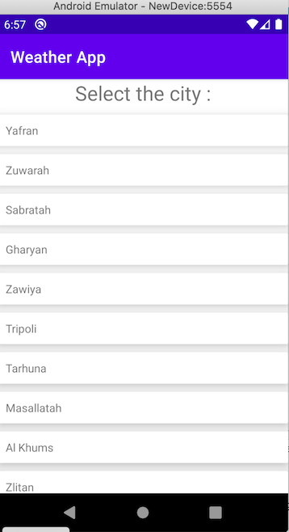
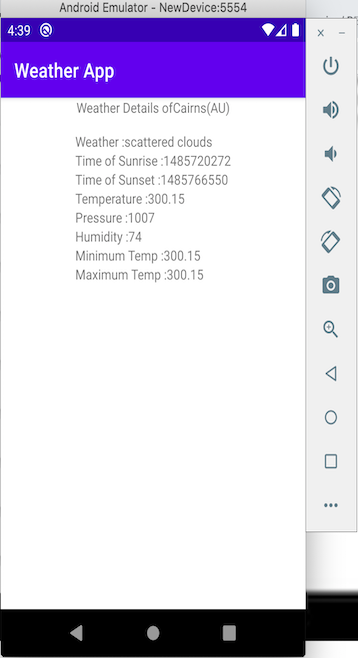

## Weather App ##

**This app is designed with MVPi design pattern and code is written in kotlin**
**App uses retrofit library to retrieve data from api end point**

The app is created to retrieve and display list of cities from given Geo Location  [weather app-list of cities](https://samples.openweathermap.org/data/2.5/box/city?bbox=12,32,15,37,10&appid=b1b15e88fa797225412429c1c50c122a1 "Weather App")
and display weather details when an item of the list is clicked from api [weather app-city weather details](https://samples.openweathermap.org/data/2.5/weather?id=2172797&appid=b1b15e88fa797225412429c1c50c122a1 "Weather App")
*The feed contains a series of articles, with titles, thumbnails, timestamps, etc, and many extraneous fields. The article summaries are displayed in a list.

It also shows user friendly messages when there is no data and when there is no network connectivity.

